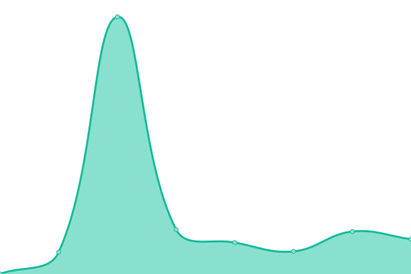

# [📈 Live Status](https://minecraft.myntu.me): <!--live status--> **🟧 Partial outage**

This repository contains the open-source uptime monitor and status page for [Minecraft NTU](https://minecraft.myntu.me), powered by [Upptime](https://github.com/upptime/upptime).

With [Upptime](https://upptime.js.org), you can get your own unlimited and free uptime monitor and status page, powered entirely by a GitHub repository. We use [Issues](https://github.com/MinecraftNTU/service-status-monitor/issues) as incident reports, [Actions](https://github.com/MinecraftNTU/service-status-monitor/actions) as uptime monitors, and [Pages](https://minecraft.myntu.me) for the status page.

<!--start: status pages-->
<!-- This summary is generated by Upptime (https://github.com/upptime/upptime) -->
<!-- Do not edit this manually, your changes will be overwritten -->
<!-- prettier-ignore -->
| URL | Status | History | Response Time | Uptime |
| --- | ------ | ------- | ------------- | ------ |
|  Minecraft Creative Server（創造服） | 🟩 Up | [minecraft-creative-server.yml](https://github.com/MinecraftNTU/service-status-monitor/commits/HEAD/history/minecraft-creative-server.yml) | 

 141ms
     
 | 

<a href="https://MinecraftNTU.github.io/service-status-monitor/history/minecraft-creative-server">100.00%</a>
    

|  [MyNTU Dashboard](https://dashboard.myntu.me) | 🟩 Up | [my-ntu-dashboard.yml](https://github.com/MinecraftNTU/service-status-monitor/commits/HEAD/history/my-ntu-dashboard.yml) | 

 136ms
     
 | 

<a href="https://MinecraftNTU.github.io/service-status-monitor/history/my-ntu-dashboard">100.00%</a>
    

|  [Bluemine](https://bluemine.myntu.me) | 🟥 Down | [bluemine.yml](https://github.com/MinecraftNTU/service-status-monitor/commits/HEAD/history/bluemine.yml) | 

 1222ms
     
 | 

<a href="https://MinecraftNTU.github.io/service-status-monitor/history/bluemine">97.98%</a>
    

|  [MineNTU Landing Page](https://minecraft.myntu.me) | 🟩 Up | [mine-ntu-landing-page.yml](https://github.com/MinecraftNTU/service-status-monitor/commits/HEAD/history/mine-ntu-landing-page.yml) | 

 218ms
     
 | 

<a href="https://MinecraftNTU.github.io/service-status-monitor/history/mine-ntu-landing-page">100.00%</a>
    

|  [MineNTU Docs Page](https://minecraft.myntu.me/docs) | 🟩 Up | [mine-ntu-docs-page.yml](https://github.com/MinecraftNTU/service-status-monitor/commits/HEAD/history/mine-ntu-docs-page.yml) | 

 142ms
     
 | 

<a href="https://MinecraftNTU.github.io/service-status-monitor/history/mine-ntu-docs-page">100.00%</a>
    

|  Service API | 🟩 Up | [service-api.yml](https://github.com/MinecraftNTU/service-status-monitor/commits/HEAD/history/service-api.yml) | 

 197ms
     
 | 

<a href="https://MinecraftNTU.github.io/service-status-monitor/history/service-api">100.00%</a>
    

|  Assistant Bot | 🟩 Up | [assistant-bot.yml](https://github.com/MinecraftNTU/service-status-monitor/commits/HEAD/history/assistant-bot.yml) | 

 202ms
     
 | 

<a href="https://MinecraftNTU.github.io/service-status-monitor/history/assistant-bot">100.00%</a>
    

<!--end: status pages-->

[**Visit our status website →**](https://minecraft.myntu.me)

## 📄 License

- Powered by: [Upptime](https://github.com/upptime/upptime)
- Code: [MIT](./LICENSE) © [Minecraft NTU](https://minecraft.myntu.me)
- Data in the `./history` directory: [Open Database License](https://opendatacommons.org/licenses/odbl/1-0/)
